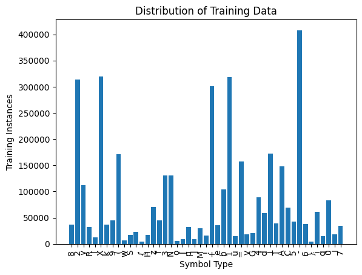
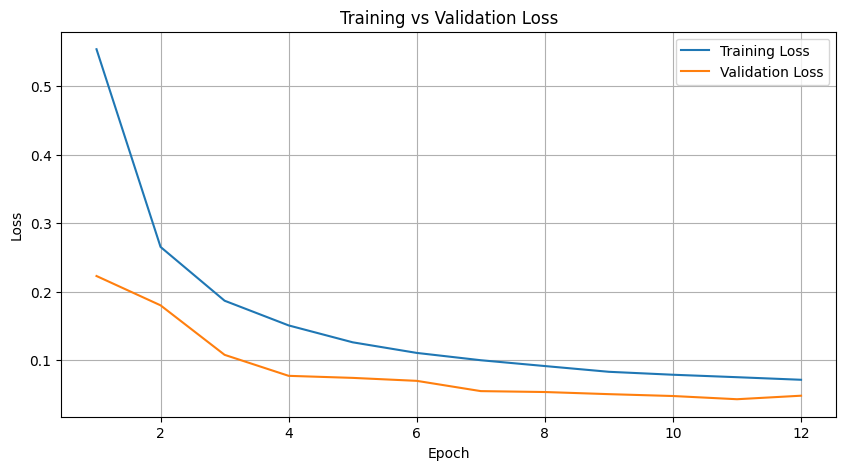

# Handwritten Math Expression Recognition and Evaluation
Welcome! This is the repository for my CS 4824 - Machine Learning Capstone Project. In this project, we build an end-to-end pipeline for parsing and symbolic evaluation of handwritten mathematical expressions using a custom CNN architecture trained on the classic CROHME dataset, as well as my personal implementation of a computer algebra system, LevyCAS.


## Installing Requirements
Use the provided `requirements.txt` to set up your environment for this project. Note that for the interactive elements, TKinter is required. While most python versions come pre-installed with package, not all do. For best results, run the Jupyter notebooks from a browser, as VSCode's built-in Jupyter server does not support all graphics features used. Since the dataset I used dopwnloads as an archive (`.rar` file), I use the `patoollib` package to extract the data. However, this package relies on a local extractor tool, like 7zip, to run. 

```bash
pip3 install -r requirements.txt
```

Since this requirements file includes releases on TestPyPi (listed with --extra-index-url), I strongly recommend installing these requirements into a new python environment:

```bash
python3 -m venv .venv
```

## Training the Model
The source code for the CNN architecture is available in `src/neuralnet.py`. To generate checkpoints, run the `train_classifier.ipynb` notebook, or load from the uploaded checkpoint file, `model.pth`. This notebook downloads the dataset to the filesystem from Kaggle, as well as contains the testing loop, complete with validation and early-stopping.



## Testing the Model
To evaluate the model at a saved checkpoint, run the `test_classifier.ipynb` notebook. This notebook contains visualizations for testing and validation loss and accuracy, as well as confusion matrices and data samples.



## Running the Pipeline
To see the model in action, run the `pipeline_example.ipynb` notebook. This notebook contains a sample implementation of how the end-to-end pipeline works, by first processing a user image, segmenting symbols, classifying, and then handing off the result to LevyCAS for evaluation.

This notebook requires Open-CV, Pillow, and TKinter to run with full interactivity. 